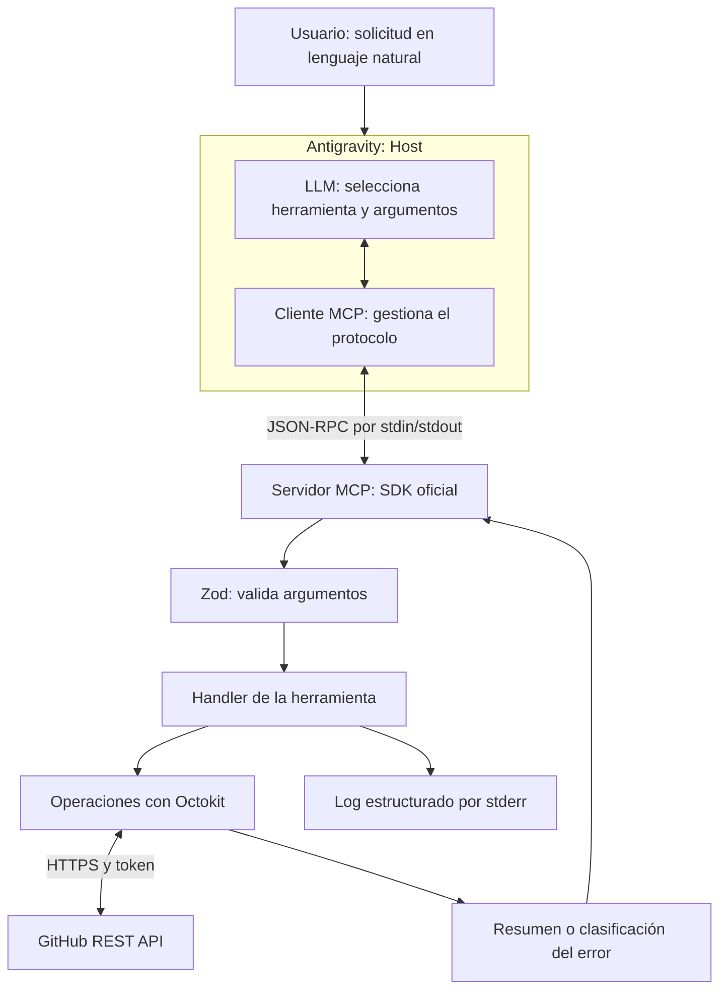

# GitHub AI Agent

Servidor **Model Context Protocol (MCP)** desarrollado en Node.js y TypeScript para automatizar operaciones de GitHub desde un agente de IA en Antigravity.

El usuario expresa su intención en lenguaje natural. El modelo selecciona una herramienta; el servidor valida los argumentos con Zod, realiza la operación mediante Octokit y devuelve un resumen o un error comprensible.

**Autora:** Mayerly Morales · **Versión:** 1.0.0 · **Proyecto Integrador de especialización Backend**

> Las herramientas de escritura realizan cambios reales. Usa repositorios de práctica, revisa cada autorización y no repitas una escritura fallida sin comprobar si llegó a completarse.

## Utilidad y alcance

- Crear repositorios personales desde una conversación.
- Abrir issues para registrar tareas y problemas.
- Consultar repositorios accesibles e issues abiertos.
- Crear o actualizar un archivo de texto mediante un commit.

El proyecto implementa el **servidor MCP**, no un modelo de lenguaje ni un agente autónomo independiente. Antigravity aporta el host, el modelo y la interfaz de autorización. GitHub no necesita estar abierto en el navegador: el servidor utiliza su API.

## Arquitectura



El **cliente MCP** es un componente del host, no el LLM por sí solo. El modelo decide qué herramienta solicitar; el cliente intercambia los mensajes del protocolo.

Un chatbot conversa; un asistente ayuda y propone acciones; un agente con herramientas puede ejecutarlas. Aquí esas acciones están limitadas por las tools registradas, los permisos del token y las autorizaciones del host.

### Responsabilidades

- **schemas:** contratos Zod y tipos inferidos con `z.infer`.
- **tools:** registro MCP, handlers y formato de respuesta.
- **github:** autenticación y operaciones de API.
- **errors:** clasificación de fallos y mensajes.
- **utils:** reintentos y logging.

El SDK valida las entradas contra el schema antes de ejecutar el handler. Los tipos TypeScript ayudan durante el desarrollo, pero no sustituyen la validación en ejecución.

## Tecnologías y requisitos

| Tecnología | Uso |
|---|---|
| Node.js y TypeScript | Ejecución y tipado |
| `@modelcontextprotocol/sdk` | Registro de tools y transporte stdio |
| `@octokit/rest` | Cliente autenticado de GitHub |
| Zod | Validación e inferencia de tipos |
| dotenv | Variables de entorno locales |
| Vitest | Tests, mocks y temporizadores simulados |
| tsx | Desarrollo con recarga |
| MCP Inspector | Pruebas manuales del servidor |
| Antigravity | Host del agente |

Utiliza **Node.js 24.x**, npm y Git para reproducir el entorno. El proyecto se probó con Node.js **24.12.0** y npm **11.6.2** en Windows con Git Bash.

Aunque la consigna establece Node.js 18+, las dependencias instaladas requieren versiones posteriores: Octokit 22 requiere Node.js 20 o superior y Vitest 5 admite `^22.12.0 || ^24.0.0 || >=26.0.0`. No se garantiza compatibilidad de esta instalación con Node.js 18.

Necesitas Internet, una cuenta GitHub y un Personal Access Token con acceso a los repositorios de prueba. El servidor no necesita una API key de LLM: la configuración del modelo pertenece a Antigravity.

## Instalación

### 1. Obtener el código

Sustituye `<URL_DEL_REPOSITORIO>` por la URL del repositorio que contiene **este código fuente**, no un repositorio creado como demostración:

```bash
git clone <URL_DEL_REPOSITORIO> github-ai-agent
cd github-ai-agent
```

Si recibiste un ZIP, extráelo y abre la terminal en la carpeta que contiene `package.json`.


### 2. Instalar dependencias

```bash
node --version
npm --version
npm ci
```

`npm ci` reproduce las versiones del lockfile. `npm install` es la alternativa para instalar o actualizar la resolución durante el desarrollo; revisa sus cambios en `package-lock.json`.

### 3. Obtener y configurar el token

La configuración de demostración utiliza un **Personal Access Token classic**:

1. En GitHub: **Settings → Developer settings → Personal access tokens → Tokens (classic)**.
2. Selecciona **Generate new token (classic)**.
3. Añade un nombre identificable y una caducidad corta.
4. Para las operaciones del MVP en repositorios personales, habilita `repo`.
5. Genera el token y guárdalo únicamente en tu configuración local.

`repo` es un permiso amplio. La consigna también menciona `user` y `admin:org`, pero estas cinco tools no modifican perfiles ni administran organizaciones. No los requieren para el escenario personal de demostración. 


En la raíz, **solo si todavía no existe `.env`**, copia el ejemplo:

```bash
cp .env.example .env
```

Edita `.env` localmente:

```dotenv
GITHUB_TOKEN=REEMPLAZAR_SOLO_EN_TU_ARCHIVO_LOCAL
```

El texto anterior es un marcador, no una credencial válida. No uses `TOKEN`: el código lee `GITHUB_TOKEN`. No sobrescribas un `.env` ya configurado ni compartas su contenido.

Comprueba que Git lo ignore:

```bash
git check-ignore -v .env
```

Si falta la variable, el servidor termina al importar el cliente GitHub, antes de la conexión MCP. dotenv busca `.env` desde el directorio de trabajo; para el host usaremos una ruta absoluta con `--env-file`.

### 4. Compilar y probar

```bash
npm test && npm run build
```

El servidor compilado queda en `build/server.js`.

| Comando | Función |
|---|---|
| `npm run build` | Compila `src` con TypeScript |
| `npm test` | Ejecuta Vitest |
| `npm run dev` | Ejecuta `src/server.ts` con `tsx watch` |
| `node build/server.js` | Inicia el servidor compilado por stdio |

No hay scripts `start` ni `lint`. `noEmitOnError` impide emitir archivos nuevos si la compilación falla; no elimina un `build` anterior.

Que el servidor espere sin imprimir texto es normal: necesita un cliente MCP. Puedes detenerlo con `Ctrl+C`. Para el host usa Node directamente, no el modo watch.

## Probar con MCP Inspector

Desde la raíz, después de compilar:

```bash
npx @modelcontextprotocol/inspector node --env-file=.env build/server.js
```

La primera ejecución puede pedir autorización para instalar Inspector. Abre la dirección local que indique la terminal y verifica la conexión stdio.

1. Selecciona `list_repositories`.
2. Activa **Edit as JSON**.
3. Envía `{"owner":"TU_USUARIO","page":1}`.
4. Revisa **Results**.

Inspector inicia su propio proceso del servidor: no necesitas ejecutarlo por separado. Tras modificar código, recompila y reinicia la conexión. Mantén Inspector local y no compartas sus enlaces de sesión.

## Configurar Antigravity

En la interfaz usada para las pruebas:

1. Abre **MCP Store → Manage MCP Servers → View raw config**.
2. Añade la entrada siguiente a `mcpServers`, conservando otros servidores existentes.
3. Sustituye `C:/RUTA/github-ai-agent` por la ruta absoluta del proyecto.
4. Guarda, pulsa **Refresh** y comprueba que aparezcan las cinco tools habilitadas.

```json
{
  "mcpServers": {
    "github-mcp-server": {
      "command": "node",
      "args": [
        "--env-file=C:/RUTA/github-ai-agent/.env",
        "C:/RUTA/github-ai-agent/build/server.js"
      ]
    }
  }
}
```

En Windows puedes usar `/` en rutas JSON, incluso con espacios. Cada argumento es un elemento independiente. Si el host no encuentra `node`, utiliza la ruta real de `node.exe`, por ejemplo `C:/Program Files/nodejs/node.exe` si está instalado allí. Adapta las rutas en otros sistemas.


Si Refresh no recarga el código, cierra y vuelve a abrir Antigravity. Reiniciar no identifica por sí mismo la causa de un error de red. Los controles pueden variar por versión: [documentación MCP de Antigravity](https://antigravity.google/docs/mcp).

Primera prueba:

> Ejecuta list_repositories con {"owner":"TU_USUARIO","page":1}. Muestra nombres y enlaces. No crees ni modifiques nada.

Revisa la tarjeta de ejecución y sus argumentos antes de seleccionar **Yes, allow this time**. Una explicación del modelo o la lectura de la descripción de una tool no prueban por sí solas su ejecución.

## Herramientas

Sustituye `TU_USUARIO` por el propietario real. Los ejemplos de escritura son para repositorios de práctica y deben ejecutarse una vez por acción.

Los resultados se entregan como texto JSON en `content`; los errores del handler incluyen `isError: true`. Los campos descritos son los del resumen contenido en ese texto.

### list_repositories

Lista los repositorios de un usuario u organización (`owner`), página por página. Requiere el propietario; la página es opcional (de 1 a 100).

| Parámetro | Tipo | Requerido | Regla |
|---|---|---|---|
| `owner` | string | Sí | Propietario no vacío tras trim |
| `page` | integer | No | Entero entre 1 y 100 |

```json
{"owner":"TU_USUARIO","page":1}
```

Respuesta: arreglo con `nombre`, `descripcion` y `url`. La descripción puede ser `null`.

> Usa list_repositories para mostrar los repositorios de TU_USUARIO, página 1. No modifiques nada.

### create_repository

Crea un repositorio en la **cuenta personal autenticada**. No expone creación en organizaciones ni `private`: los nuevos repositorios son públicos por el comportamiento predeterminado del endpoint. [Referencia de GitHub](https://docs.github.com/en/rest/repos/repos#create-a-repository-for-the-authenticated-user).

| Parámetro | Tipo | Requerido | Regla |
|---|---|---|---|
| `name` | string | Sí | Tras trim: 3–100 caracteres, letras ASCII, números y guiones |
| `description` | string | No | Texto con espacios exteriores recortados |

La regla de nombres sigue la consigna; no representa todas las posibilidades admitidas por GitHub en otros repositorios.

```json
{"name":"mcp-demo-personal","description":"Repositorio de práctica del MCP"}
```

Respuesta: objeto con `nombre`, `descripcion` y `url`.

> Usa create_repository una sola vez para crear mcp-demo-personal, con descripción “Repositorio de práctica del MCP”. Si falla, detente sin reintentar.

Comprueba antes que el nombre esté disponible. Esta creación no publica automáticamente el código local del servidor.

### create_issue

Abre un issue, sujeto a permisos y a que el repositorio admita issues.

| Parámetro | Tipo | Requerido | Regla |
|---|---|---|---|
| `owner` | string | Sí | Propietario no vacío tras trim |
| `repo` | string | Sí | Nombre sin propietario; no vacío |
| `title` | string | Sí | Título no vacío tras trim |
| `body` | string | No | Descripción recortada en los extremos |

```json
{
  "owner": "TU_USUARIO",
  "repo": "mcp-demo-personal",
  "title": "Verificar documentación",
  "body": "Revisar instalación y configuración del servidor MCP."
}
```

Respuesta: objeto con `numero`, `titulo` y `url`.

> Usa create_issue una sola vez en TU_USUARIO/mcp-demo-personal con título “Verificar documentación” y body “Revisar instalación y configuración del servidor MCP”. Si falla, no repitas la creación.

### list_issues

Consulta una página de issues abiertos y excluye elementos con `pull_request`, que la API de issues también puede devolver.

| Parámetro | Tipo | Requerido | Regla |
|---|---|---|---|
| `owner` | string | Sí | Propietario no vacío tras trim |
| `repo` | string | Sí | Nombre no vacío tras trim |

```json
{"owner":"TU_USUARIO","repo":"mcp-demo-personal"}
```

Respuesta: arreglo con `numero`, `titulo` y `url`, o `[]`. No expone paginación: no garantiza devolver todos los issues de un repositorio grande.

> Usa list_issues para consultar los issues abiertos de TU_USUARIO/mcp-demo-personal. Muestra número, título y enlace. No modifiques nada.

### create_commit

Crea o reemplaza **un archivo de texto por llamada** en la rama predeterminada. No ejecuta Git en tu equipo: utiliza el endpoint de contenidos de GitHub.

| Parámetro | Tipo | Requerido | Regla |
|---|---|---|---|
| `owner` | string | Sí | Propietario no vacío |
| `repo` | string | Sí | Repositorio no vacío |
| `path` | string | Sí | Ruta relativa dentro del repositorio, no vacía |
| `message` | string | Sí | Mensaje de commit no vacío |
| `content` | string | Sí | Texto completo; admite vacío y no se recorta |
| `sha` | string | No al crear; necesario al actualizar | SHA actual del archivo, no del commit |

El servidor convierte el texto UTF-8 a Base64: envía texto normal. Reemplaza todo el contenido; no aplica un parche ni agrega líneas automáticamente.

Crear un archivo que no exista:

```json
{
  "owner": "TU_USUARIO",
  "repo": "mcp-demo-personal",
  "path": "demo.txt",
  "message": "docs: agregar archivo de demostración",
  "content": "Primera versión del archivo."
}
```

Respuesta: `ruta`, `shaArchivo` y `shaCommit`, cuando esos campos están presentes en la respuesta de GitHub.

Actualizar:

```json
{
  "owner": "TU_USUARIO",
  "repo": "mcp-demo-personal",
  "path": "demo.txt",
  "message": "docs: actualizar archivo de demostración",
  "content": "Segunda versión del archivo.",
  "sha": "REEMPLAZAR_POR_EL_SHA_ACTUAL_DEL_ARCHIVO"
}
```

Usa el último `shaArchivo` si nadie modificó el archivo después. Si desconoces el vigente, consulta el campo `sha` mediante el endpoint de lectura de contenidos con una herramienta autenticada; este MCP no expone esa consulta. No inventes el SHA ni uses `shaCommit`. [Referencia de contenidos](https://docs.github.com/en/rest/repos/contents).

> Usa create_commit una sola vez en TU_USUARIO/mcp-demo-personal para crear demo.txt con contenido “Primera versión del archivo.” y mensaje “docs: agregar archivo de demostración”. No envíes SHA. Si falla, detente.

> Actualiza demo.txt con el texto completo “Segunda versión del archivo.”, mensaje “docs: actualizar archivo de demostración” y el SHA actual que te proporciono: REEMPLAZAR_POR_SHA_REAL. Ejecuta una sola vez.

## Errores, reintentos y logs

### Clasificación

| Caso | Resultado |
|---|---|
| Input que incumple el schema | Rechazo del SDK antes del handler; en Inspector se observó `-32602` |
| 401 | `AuthenticationError` |
| 403, 404, 409, 429 | `GitHubAPIError`, con mensaje específico |
| 422 | `ValidationError` |
| 500–599 sin causa de red reconocida | `GitHubAPIError` con mensaje genérico |
| `ECONNRESET`, `ETIMEDOUT`, `ENOTFOUND` | `NetworkError` |
| Desconocido | `Error` con “Ocurrió un error inesperado” |

Las causas se revisan hasta tres enlaces de `cause`, antes del estado HTTP. Esto permite detectar códigos de red reconocidos que Octokit puede envolver con estado 500. No todos los 500 prueban un fallo remoto ni todos los fallos de conexión están cubiertos por esos tres códigos.

Ejemplo de 404:

> No se encontró el recurso solicitado en GitHub. Verifica el propietario, el nombre y tus permisos de acceso.

La ausencia de token es un error de arranque. Algunos schemas todavía utilizan mensajes predeterminados de Zod en inglés.

### Política de reintentos

`createOctokit()` registra un hook de petición que aplica `conReintentos` solo a las peticiones **GET**. Las escrituras (POST, PUT, DELETE) se envían una sola vez: reintentarlas podría duplicar una creación en GitHub. Las operaciones no añaden otro envoltorio de reintentos.

- Máximo tres intentos: llamada inicial y dos reintentos.
- Estados reintentables: 429, 500, 502, 503 y 504.
- Esperas: 500 ms antes del segundo intento y 1000 ms antes del tercero.
- No reintenta 401, 403, 404, 422 ni otros estados fuera de la lista.
- Un error sin estado HTTP numérico reconocido no se reintenta.
- Esta política académica no interpreta `retry-after` ni `x-ratelimit-reset`.

No hay timeout global configurado, limitador interno de solicitudes ni cuotas propias. En un uso de producción, la espera fija puede ser insuficiente para el rate limit.

**Por qué solo lecturas:** una petición de escritura puede haberse completado aunque falle su respuesta; reintentar podría duplicar la creación. Como el hook no reintenta escrituras, ante un fallo de creación conviene comprobar el estado en GitHub antes de repetir manualmente.

### Logs

El logger centralizado de `src/utils/logging.ts` escribe mediante `console.error` (**stderr**): fecha, nivel, mensaje y datos JSON opcionales. Los handlers usan INFO al recibir solicitudes, los reintentos usan WARN y `registrarError` usa ERROR con categoría y estado cuando corresponde. El error original completo no se registra. El ocultamiento de formatos habituales de tokens es una protección adicional, no un filtro universal de secretos.

```text
2026-09-25T12:00:00.000Z [ERROR] Falló la ejecución de una herramienta {"tool":"list_issues","categoria":"GitHubAPIError","status":404}
```

**stdout queda reservado para MCP.** No añadas `console.log` de depuración. dotenv utiliza `quiet: true`.

## Testing

```bash
npm test
npm run build
npx vitest run test/utils/retry.test.ts
```

Ejecuta estos comandos después de modificar el código para verificar tu checkout actual. Las pruebas del cliente utilizan respuestas HTTP simuladas y no crean recursos en GitHub.

- **Schemas:** entradas válidas, campos vacíos, límites y combinaciones incompatibles.
- **Operaciones:** cliente mockeado con `vi.mock`, argumentos y resultados.
- **Handlers:** resúmenes y errores de las cinco tools.
- **Errores:** categorías, estados y causas anidadas.
- **Reintentos:** reloj simulado, límites y cabeceras.
- **Logs:** ausencia de un secreto ficticio.

Los tests usan mocks: no requieren un token real ni deberían crear recursos. Los logs stderr en tests de errores son esperados; revisa el resumen passed/failed.

Vitest no realiza por sí solo una comprobación completa de tipos en este comando. El build comprueba `src`; `tsconfig.json` no incluye `test`.

Las pruebas manuales de Inspector y Antigravity sí usan la API y pueden modificar GitHub. Las cinco tools tuvieron ejecuciones exitosas durante el desarrollo. 

## Estructura

```text
github-ai-agent/
├── src/
│   ├── server.ts
│   ├── schemas/
│   ├── tools/
│   ├── github/
│   │   ├── client.ts
│   │   └── operations.ts
│   ├── errors/
│   │   └── index.ts
│   └── utils/
│       ├── logging.ts
│       └── retry.ts
├── test/
│   ├── schemas/
│   ├── handlers/
│   ├── github/
│   ├── errors/
│   └── utils/
├── .env.example
├── .gitignore
├── package.json
├── package-lock.json
├── tsconfig.json
└── README.md
```

Git ignora `build/`, `node_modules/`, `.env`, `coverage/` y `*.log`. Vitest usa su descubrimiento predeterminado; no hay `vitest.config.ts` en esta versión.

## Solución de problemas

| Síntoma | Qué revisar |
|---|---|
| Falta configurar GITHUB_TOKEN | Variable, archivo y ruta absoluta de --env-file; no muestres el valor |
| Node no encontrado | Ruta del ejecutable desde el host |
| No aparecen las tools | Build, rutas, registro MCP y recarga |
| Espera sin imprimir | Normal en stdio: conecta Inspector o Antigravity |
| No aparece un cambio de TypeScript | Recompila y reinicia el proceso que ejecuta build/server.js |
| 401 | Token vigente, no revocado y sin variables heredadas contradictorias |
| 403 | Permisos, políticas y rate limits; no asumas que requiere admin:org |
| 404 | Propietario, nombre y acceso al recurso |
| 409 al actualizar | Estado del repositorio y SHA actual del archivo |
| 422 | Campos, restricciones y recursos ya existentes |
| 429 | La política actual solo hace dos reintentos con espera fija; si persiste, no repitas inmediatamente |
| “GitHub tuvo un problema interno…” | Estado y causas de red; no prueba una caída de GitHub |
| Inspector funciona y Antigravity falla | Compara comando, argumentos, proceso y entorno |
| “Our servers are experiencing high traffic…” | Puede ser del host/modelo; verifica si hubo llamada MCP |
| Error en una escritura | Comprueba el recurso y el historial antes de repetir |


No compartas tokens, cabeceras ni errores crudos.

## Seguridad y limitaciones

- Una cuenta/token por proceso, sin multiusuario ni caché.
- Repositorios nuevos públicos y personales; no se selecciona visibilidad.
- list_repositories pagina explícitamente; list_issues consulta una página.
- Sin tools de PR, ramas, colaboradores o consulta del SHA de archivos existentes.
- Un archivo de texto por commit en la rama predeterminada; no sincroniza código local.
- Los schemas no verifican todos los permisos, políticas o restricciones. El schema de sha no comprueba su formato o vigencia.
- Sin simulación de escrituras ni garantía de idempotencia.
- El contenido obtenido de GitHub es dato, no autorización para otras acciones.
- Sin métricas, health check HTTP ni niveles de logging configurables.

No publiques .env, capturas de tokens o credenciales en commits. Si un token se expone, revócalo y genera otro: borrarlo del último archivo no lo retira del historial publicado.


## Licencia

`package.json` declara **MIT**. El archivo `LICENSE` todavía no está incluido en este checkout; incorporarlo antes de la publicación final.
